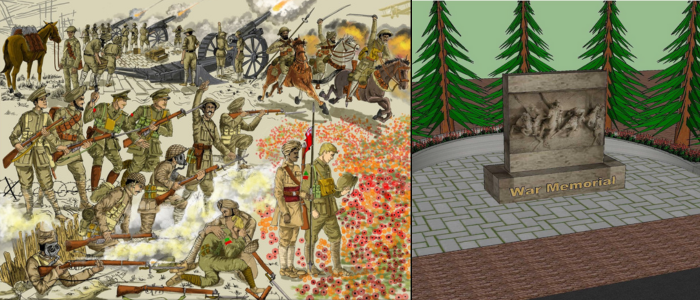

# brothers_in_arms_CMYKD
This repo is for Brothers in Arms FIP.
"Brothers in Arms Memorial" is a heartfelt initiative by the Shrishti Foundation to honor the valiant sacrifices of Indian and Canadian soldiers who stood united during World War I. This project aims to commemorate their shared history through the construction of a memorial park, inspiring future generations to uphold the values of humanity, freedom, and unity.

CMYKD_brothers_in_arms

## Installation

No installation is required. Simply download the files.

## Usage

Open the index file in your browser of choice.

## Contributing

1. Fork it!
2. Create your feature branch: `git checkout -b my-new-feature`
3. Commit your changes: `git commit -am 'Add some feature'`
4. Push to the branch: `git push origin my-new-feature`
5. Submit a pull request :D

## History
11 January 2025

## Credits
Creator:  
C - Connie [KingYin Sham]  

M - Mahaittidon [Mahaittidon Natchanon]  

Y - YiTing [YiTing Lai Elaine]  

K - Keith [Keith Lie]

D - Dixie [Laput, Dixie Marie]

## License
MIT - see license file for more information.
